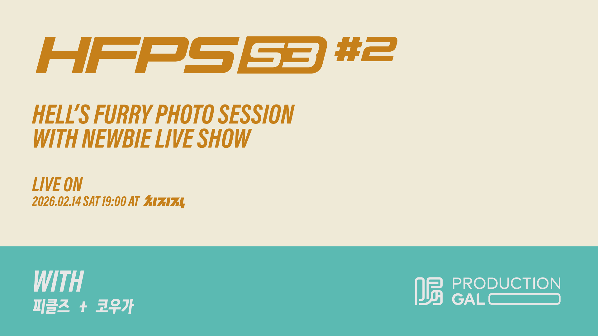

<div align="center">

</div>

# 🎰 BalanceGame Roulette OBS System

**HFPS S3 E2 Live 밸런스 게임에 사용될 에셋 시스템입니다.**

밸런스 게임 주제를 랜덤으로 선정하는 룰렛 시스템으로, OBS 브라우저 소스를 통해 라이브 방송 화면에 직접 오버레이할 수 있습니다. 별도의 컨트롤 패널에서 룰렛을 조작하고, 점수를 관리할 수 있습니다.

---

## 🖥️ 페이지 구성

| 경로 | 설명 |
|---|---|
| `/` | **디스플레이** — OBS 브라우저 소스로 사용되는 룰렛 오버레이 화면 |
| `/control` | **컨트롤 패널** — 룰렛 시작/정지, 점수 관리 등 방송 운영 페이지 |
| `/topic` | **주제 관리** — 밸런스 게임 주제 목록 확인 페이지 |

## ✨ 주요 기능

- 🎡 세로 스크롤 룰렛 애니메이션 (부드러운 감속 효과)
- 🏆 당첨 결과 모달 표시
- 📊 팀별 스코어보드 및 점수 조작
- 🔄 `BroadcastChannel`을 이용한 컨트롤↔디스플레이 실시간 동기화
- 🎨 항목별 컬러 프리셋

## 🛠️ 기술 스택

- **React** 19 + **TypeScript**
- **Vite** (빌드 & 개발 서버)
- **Lucide React** (아이콘)

## 🚀 로컬 실행

**필수:** Node.js

```bash
# 의존성 설치
npm install

# 개발 서버 시작
npm run dev
```

개발 서버가 실행되면:

- `http://localhost:3000/` → OBS 오버레이 (디스플레이)
- `http://localhost:3000/control` → 컨트롤 패널
- `http://localhost:3000/topic` → 주제 관리

## 📁 프로젝트 구조

```
├── App.tsx                 # 라우팅 (경로별 페이지 분기)
├── constants.ts            # 밸런스 게임 주제 데이터 & 룰렛 설정
├── types.ts                # 타입 정의
├── components/
│   ├── ControlPanel.tsx    # 룰렛 조작 패널
│   ├── RouletteDisplay.tsx # 룰렛 애니메이션 렌더링
│   ├── ScoreBoard.tsx      # 스코어보드 UI
│   ├── ScoreControls.tsx   # 점수 조작 컨트롤
│   └── WinnerModal.tsx     # 당첨 결과 모달
├── hooks/
│   └── useBroadcast.ts     # BroadcastChannel 커스텀 훅
└── pages/
    ├── ControlPage.tsx     # 컨트롤 페이지
    ├── DisplayPage.tsx     # OBS 오버레이 페이지
    └── TopicPage.tsx       # 주제 관리 페이지
```
